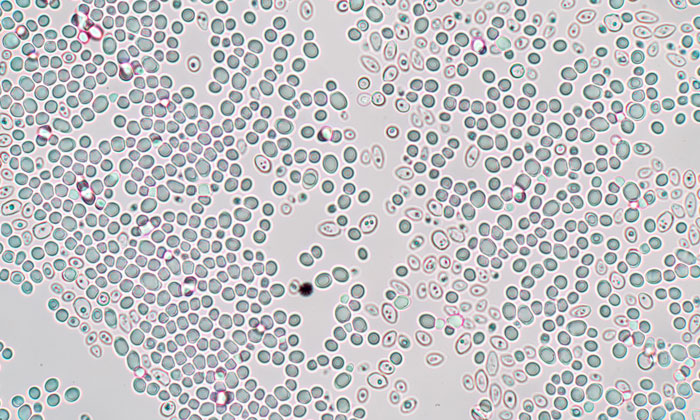

# yeast_counter
This is an app to count yeast cells from a hemocytometer image.

## premise
Counting yeast cells typically involves making a dilution with methylene blue which turns dead cells blue.
Then, you put the dilution under a microscope and count the dead and living cells. This tells you two things.
It tells you the percent of viable cells, and the concentration of viable cells. 

## how it works

You start with an image from your microscope. This is produced by creating a 1:100 dilution by taking 1ml of your yeast and 99ml of distilled water/methylene blue solution.

